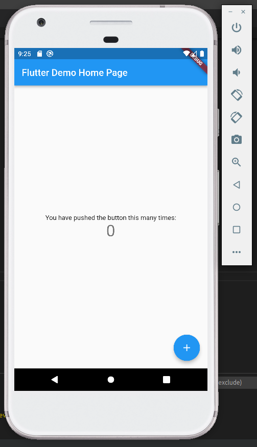

# Criando o nosso primeiro app

Agora que você já tem todas instalações necessárias, podemos começar a desenvolver o nosso primeiro projeto.

## Gerando o projeto no VS Code
Por questões de praticidade, nesse projeto, iremos utilizar o edito de textos VS Code. 

- Inicie o VS Code.
- Clique em *View -> Command Palette*.
- Digite "Flutter" e selecione **Flutter: New Aplication Project**.
- Selecione o diretório desejado para criar o projeto.
- Escolha o nome do projeto. Para esse tutorial, usaremos o nome *nomes_startups*.

Se o arquivo *main.dart* abrir, parabéns! O seu primeiro projeto em Flutter está criado.

## Rodando o app
- Procure o a barra de acesso do VS Code
- Selecione o dispositivo desejado. Caso não haja nenhum, selecione **No devices**.
- Rode o projeto na opção *Start Debugging*.

Você deve ter visto uma tela parecida com essa no seu dispositivo. Vamos começar a programar, enfim!


## Primeiras mudanças
Localize o seguinte trecho do arquivo *main.dart*:
``` dart
const Text(
              'You have pushed the button this many times:',
            ),
```

Mude a palavra "pushed" para "clicked", da seguinte maneira:
```dart
const Text(
              'You have clicked the button this many times:',
            ),
```

Em seguida, salve o arquivo. A mudança deve ter sido feita, sem nenhum tipo de reload.

---
**OBSERVAÇÃO**

O Flutter oferece um sistema de desenvolvimento rápido chamado Stateful Hot Reload, que possui a habilidade de alterar um código sem ter que reiniciá-lo.

---

## Finalmente, começando a adicionar funcionalidades!

Para começar a entender mais sobre a linguagem Flutter, substitua todo código no arquivo *main.dart* pelo seguinte código:
```dart
// Copyright 2018 The Flutter team. All rights reserved.
// Use of this source code is governed by a BSD-style license that can be
// found in the LICENSE file.

import 'package:flutter/material.dart';

void main() => runApp(MyApp());

class MyApp extends StatelessWidget {
  @override
  Widget build(BuildContext context) {
    return MaterialApp(
      title: 'Welcome to Flutter',
      home: Scaffold(
        appBar: AppBar(
          title: const Text('Welcome to Flutter'),
        ),
        body: const Center(
          child: Text('Hello World'),
        ),
      ),
    );
  }
}

```

Esse código simplesmente printa um ```Hello World``` na tela inicial do app.

### Observações sobre o código acima:
- Esse código gera um [App Material](https://material.io/guidelines). Para aplicativos de web e mobile, é recomendado que os aplicativos tenham essa configuração, e geralmente são mais usados.
- Como você pode observar, o método ```main()``` utiliza a flecha (```=>```) como notação. Para funções ou métodos de uma linha só, utilize sempre essa flecha.
- A classe ```MyApp``` extende (herda) )um tal de ```StatelessWidget```. Essa classe torna o próprio app em um widget. Ao programar utilizando Flutter, é preciso saber que quase tudo é um widget, inclusive o alinhamento, layout, etc.
- O widget ```Scaffold``` implementa a estrutura do layout visual da tela. Em apps Materiais, ele é usado com o widget ```MaterialApp```. Para cada nova tela que será feita, o widget ```Scaffold``` é acionado, enquanto o outro é feito apenas uma vez.

## Adicionando pacotes externos
Localize o arquivo *pubsec.yaml* e adicione a seguinte linha no seu arquivo:
```dart
dependencies:
  flutter:
    sdk: flutter


  # The following adds the Cupertino Icons font to your application.
  # Use with the CupertinoIcons class for iOS style icons.
  cupertino_icons: ^1.0.2
```

Adicione em uma linha o seguinte código: ```english_words: ^4.0.0```. Você deve estar se perguntando o que é esse tal de *english_words*. Bom, é um pacote que contém algumas palavras em inglês, e outras funções importantes. Esse pacote será importante para o nosso projeto. Caso queira ver alguns outros pacotes, dê uma olhada [nesse link](https://pub.dev/). Se tudo correr conforme o esperado, você deve ver um output no seu código contendo as seguintes linhas:
```dart
[nomes_startups] flutter pub get
Running "flutter pub get" in nomes_startups...                      3.2s
exit code 0
```

Isso significa que o pacote foi incluso no seu projeto! Adicione agora no arquivo *main.dart*, perto dos imports:
```dart
import 'package:english_words/english_words.dart';            #linha a ser incluída
import 'package:flutter/material.dart';
```

Com os imports prontos, que tal adicionarmos essa funcionalidadade na nossa tela? Substitua os seguintes trechos de código:
```dart hl_lines="1-130"
class MyApp extends StatelessWidget {
  @override
  Widget build(BuildContext context) {
    final wordPair = WordPair.random();             #linha adicionada para gerar palavras aleatorias!
    return MaterialApp(
      title: 'Welcome to Flutter',
      home: Scaffold(
        appBar: AppBar(
          title: const Text('Welcome to Flutter'),
        ),
        body: Center(                              #essas 2 linhas devem ser adicionadas no lugar da
          child: Text(wordPair.asPascalCase),      #que printa Hello, World!
        ),
      ),
    );
```

A partir de agora, a tela do seu emulador deve conter algo parecido com isso:


Cada vez que você salvar a página *main.dart*, um novo nome deve aparecer na tela. Essa é a funcionalidade do tal do *english_words*! Lembre-se que para isso ser possível, o aplicativo precisa estar rodando, que nem foi descrito no começo dessa etapa. Agora que temos a criação do nosso aplicativo encaminhada, vamos para a [3a parte do tutorial](https://jonathansutton1.github.io/TecWeb-Projeto3/P3/), onde terminaremos o desenvolvimento.


  
