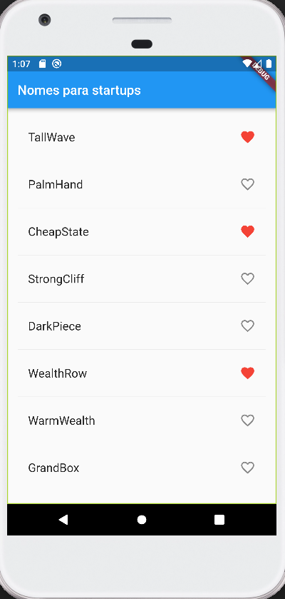

# Tornando a nossa página interativa

## Adicionando ícones 
Agora que você tem uma tela com vários nomes, que tal adicionar uma funcionalidade interativa? Vamos adicionar o botão de *like* para cada linha. Adicione o dicionário ```_saved``` na classe ```_RandomWordsState```, da seguinte maneira. Esse componente servirá para salvar as palavras curtidas.

```dart
class _RandomWordsState extends State<RandomWords> {
  final _suggestions = <WordPair>[];
  final _saved = <WordPair>{};     // ADICIONE ESSA LINHA
  final _biggerFont = TextStyle(fontSize: 18.0);
  ...
}
```

Na widget ```_buildRow```, adicione um check ```alreadySaved```. Isso servirá para garantir que uma palavrá não será salva mais de uma vez.

```dart
Widget _buildRow(WordPair pair) {
  final alreadySaved = _saved.contains(pair);  // ADICIONE ESSA LINHA
  ...
}
```

Vamos agora incluir os ícones de coração para definir as curtidas. De novo na widget ```_buildRow```, adicione as seguintes linhas:

```dart
Widget _buildRow(WordPair pair) {
  final alreadySaved = _saved.contains(pair);
  return ListTile(
    title: Text(
      pair.asPascalCase,
      style: _biggerFont,
    ),
    trailing: Icon(   // ADICIONE A PARTIR DAQUI
      alreadySaved ? Icons.favorite : Icons.favorite_border,
      color: alreadySaved ? Colors.red : null,
      semanticLabel: alreadySaved ? 'Remove from saved' : 'Save',
    ),                // ATÉ AQUI
  );
}
```

Experimente dar um hot reload no seu emulador! Os corações já devem estar aparecendo, mas não são interativos. Vamos então adicionar funcionalidades para mexer neles!


## Deixando o app interativo
Estamos quase terminando o tutorial! Aguente firme, vamos fazer uma última mudança. O objetivo final é criar uma funcionalidade para que o usuário consiga clicar nos corações, e escolha as palavras que goste mais. Para isso, vamos mudar a widget ```_buildRow```. A idéia é fazer com que, quando uma palavra é acessada, a função chame o ```setState()``` para notificar a framework para mudar o estado.

```dart
Widget _buildRow(WordPair pair) {
  final alreadySaved = _saved.contains(pair);
  return ListTile(
    title: Text(
      pair.asPascalCase,
      style: _biggerFont,
    ),
    trailing: Icon(
      alreadySaved ? Icons.favorite : Icons.favorite_border,
      color: alreadySaved ? Colors.red : null,
      semanticLabel: alreadySaved ? 'Remove from saved' : 'Save',
    ),
    onTap: () {      // ADICIONE A PARTIR DAQUI
      setState(() {
        if (alreadySaved) {
          _saved.remove(pair);
        } else { 
          _saved.add(pair); 
        } 
      });
    },               // ATÉ AQUI
  );
}
```

Dê um hot reload. Deu certo? Você consegue escolher os nomes desejados? 


Meus parabéns! Você chegou ao fim do nosso tutorial! Disponibilizaremos alguns mais complexos caso você queira se aprofundar mais. Obrigado pela atenção! :)